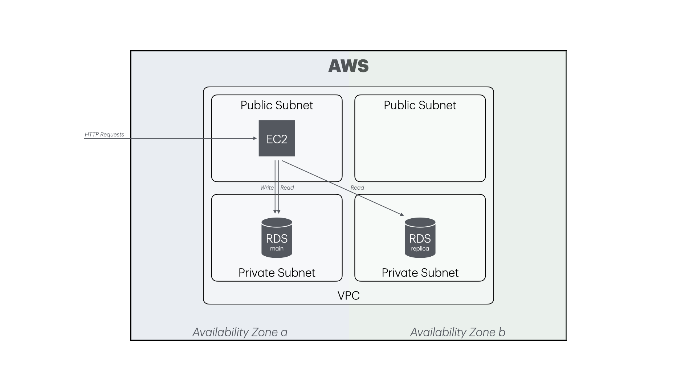

# item-search-webapp-demo-202508-provisioning



## How to Use

<u>Docker and [Docker Compose](https://docs.docker.com/compose/)</u> are needed. If you want to provision only local environments, that's all.

And you need to set up the repository following steps.

### Step 1. Write out your IDs and credentials in the .env file.

You should write your account IDs and credentials depending on your need, such as AWS, Azure, and Google Cloud, in the `.env` file as follows.

```.env
# UID=1234
# GID=1234
# DOCKER_GID=2345
PROJECT_UNIQUE_ID=my-unique-b78e
TF_VAR_allowed_ipaddr_list=["203.0.113.0/24"]
#
# <AWS>
AWS_ACCESS_KEY_ID=AKXXXXXXXX
AWS_ACCOUNT_ID=123456789012
# AWS_DEFAULT_REGION=us-east-1
AWS_SECRET_ACCESS_KEY=AWxxxxxxxx00000000
# </AWS>
```

:information_source: If you are using Linux, write out UID, GID, and GID for the `docker` group, into the `.env` file to let that as exported on Docker Compose as environment variables.

```console
test $(uname -s) = 'Linux' && {
  echo -e "DOCKER_GID=$(getent group docker | cut -d : -f 3)"
  echo -e "GID=$(id -g)"
  echo -e "UID=$(id -u)"
} >> .env || :
```

#### Environment Variable Names

Environment variable names and uses are as follows.

| Name       | Required on Linux | Value                                                                                                                                   |
| ---------- | ----------------- | --------------------------------------------------------------------------------------------------------------------------------------- |
| UID        | **Yes**           | This ID number is used as UID for your Docker user, so this ID becomes the owner of all files and directories created by the container. |
| GID        | **Yes**           | The same as the above UID.                                                                                                              |
| DOCKER_GID | **Yes**           | This ID number is used to provide permission to read and write your docker socket on your local machine from your container.            |

| Name                       | Required with Terraform | Value                                                                                                                                         |
| -------------------------- | ----------------------- | --------------------------------------------------------------------------------------------------------------------------------------------- |
| PROJECT_UNIQUE_ID          | **Yes**                 | An ID to indicate your environment.<br/>The value is used for the name of the Object Storage bucket or Storage Account for Terraform backend. |
| TF_VAR_allowed_ipaddr_list | no                      | IP address ranges you want access to your cloud environment.                                                                                  |

</details>
<details>
<summary>AWS</summary>

| Name                  | Required with AWS | Value                                                                                                                                                 |
| --------------------- | ----------------- | ----------------------------------------------------------------------------------------------------------------------------------------------------- |
| AWS_ACCOUNT_ID        | **Yes**           | A 12-digit AWS Account ID you want to provision.<br/>The S3 bucket is created in this account to store the tfstate file if you choose the S3 backend. |
| AWS_ACCESS_KEY_ID     | **Yes**           | An AWS Access Key for the IAM user that is used to create the S3 bucket to store tfstate file and apply all in your AWS environment.                  |
| AWS_SECRET_ACCESS_KEY | **Yes**           |                                                                                                                                                       |
| AWS_DEFAULT_REGION    | no                |                                                                                                                                                       |

</details>

### Step 2. Define your service in the `compose.yaml`

You are able to update and define the `provisioning` service to your need in the [`compose.yaml`](compose.yaml).

```yaml
services:
  provisioning:
    <<: *provisioning-base
```

Make sure your config.

```console
docker compose config
```

Now, you are able to provision your environment as follows. :tada:

```console
docker compose build
```

```console
docker compose up
```

```console
docker compose exec provisioning terraform apply
```

```console
docker compose down
```
